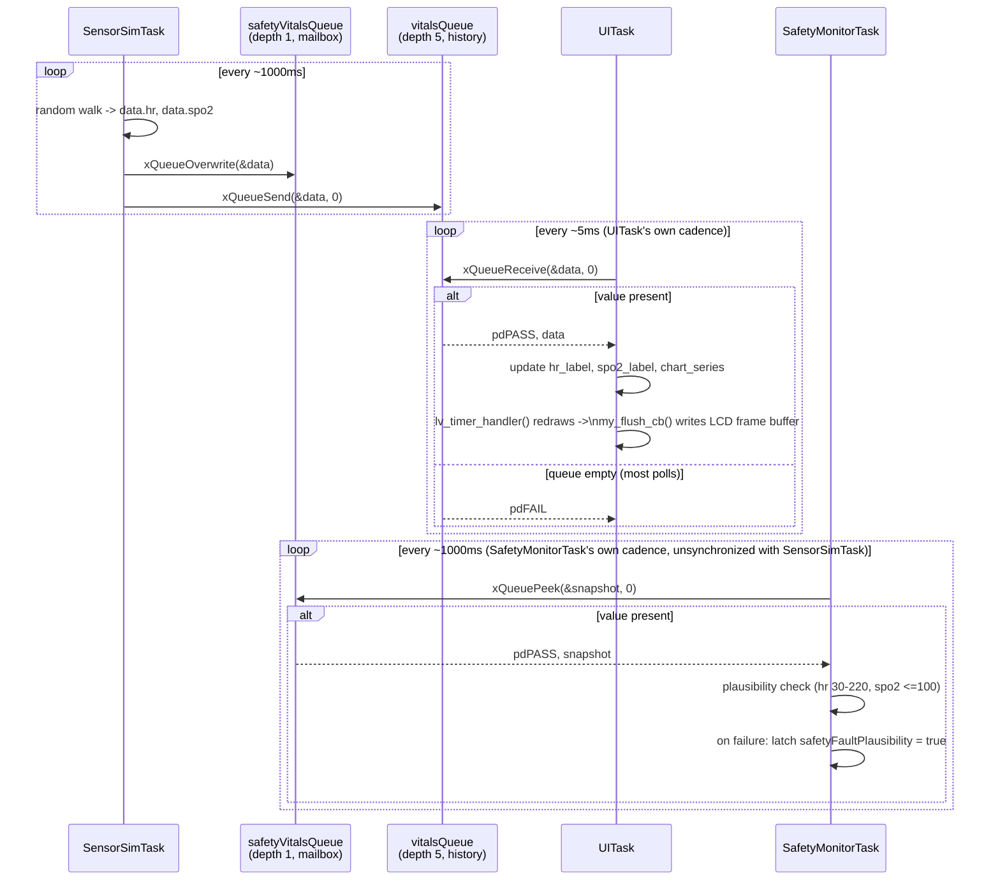

# Task Architecture

Source of truth: [`Src/main.c`](../Src/main.c). This document describes the three FreeRTOS
tasks that make up the application, their priorities/stack sizes, what each does per loop
iteration, what shared state each reads and writes, and what each blocks/waits on.

FreeRTOS config relevant to all three (`Inc/FreeRTOSConfig.h`): `configTICK_RATE_HZ = 1000`
(1 tick = 1ms, so `pdMS_TO_TICKS(x) == x`), `configMAX_PRIORITIES = 7`, `configUSE_PREEMPTION = 1`,
`configCHECK_FOR_STACK_OVERFLOW = 2`, heap_4 allocator with `configTOTAL_HEAP_SIZE = 32KB`.
`tskIDLE_PRIORITY` is the standard FreeRTOS value, 0. Stack sizes passed to `xTaskCreate()` are in
32-bit words on this port (Cortex-M, `portSTACK_TYPE = uint32_t`), not bytes.

A round of `TEMPORARY DIAGNOSTIC`-tagged instrumentation (per-section timing traces, `eTaskGetState()`
fault snapshots, the LVGL heap-monitor readout) was added, used to investigate an intermittent
watchdog-reset bug, and then removed once the investigation concluded — see [Known issues](#known-issues--resolved)
below. What remains tagged `TEMPORARY DIAGNOSTIC` is smaller: the three per-task stack high-water
marks (`uiTaskStackHighWaterMark`/`sensorTaskStackHighWaterMark`/`safetyTaskStackHighWaterMark`),
still live pending stack-sizing confirmation, and the D-Cache-disabled state in `CPU_CACHE_Enable()`,
kept as a precaution though it's no longer implicated in anything active.

## Summary

| | UITask | SensorSimTask | SafetyMonitorTask |
|---|---|---|---|
| **Priority** | `tskIDLE_PRIORITY + 1` (1) | `tskIDLE_PRIORITY + 1` (1) | `tskIDLE_PRIORITY + 2` (2) — highest, preempts both |
| **Stack** | 2048 words / 8KB | 512 words / 2KB | 512 words / 2KB |
| **Handle** | `uiTaskHandle` | none — `xTaskCreate()`'s handle param is `NULL` | none — `xTaskCreate()`'s handle param is `NULL` |
| **Nominal period** | ~5ms (busy) | ~1000ms (+20ms on a successful send) | ~1000ms |
| **Main block point** | `vTaskDelay(pdMS_TO_TICKS(5))` | `vTaskDelay(pdMS_TO_TICKS(1000))` | `vTaskDelay(pdMS_TO_TICKS(1000))` |
| **Other blocking risk** | `HAL_I2C_Mem_Read()` inside touch read, up to ~50ms/transaction, ~450ms worst case across a whole `BSP_TS_GetState()` call (see touch driver docs) | none beyond the 20ms debug-flash delay | none |
| **Queues touched** | `vitalsQueue` (consumer) | `vitalsQueue` (producer), `safetyVitalsQueue` (producer) | `safetyVitalsQueue` (consumer) |
| **Created at** | `main.c:212` | `main.c:215` | `main.c:225` |
| **Defined at** | `main.c:279` | `main.c:525` | `main.c:598` |

Both `UITask` and `SensorSimTask` share priority 1, so they round-robin/time-slice when both are
ready (`configUSE_TIME_SLICING` defaults to 1, unset in this config). In practice this rarely
matters: `SensorSimTask` is asleep in `vTaskDelay(1000ms)` almost the entire time, so `UITask`
effectively has priority 1 to itself.

---

## UITask

**Priority 1, 8KB stack, handle `uiTaskHandle`.** Owns all LVGL state end-to-end — `lv_init()`,
display/touch driver registration, theme, every widget, and the `lv_timer_handler()` pump. LVGL
isn't thread-safe by default, so every LVGL call is confined to this one task.

### One-time setup (before the loop)

- `lv_init()`, `lv_tick_set_cb(HAL_GetTick)` — LVGL takes its tick from the same `HAL_GetTick()`
  SysTick already drives, rather than a second tick source.
- Creates the `lv_display_t`, registers `my_flush_cb` ([`lv_port_disp.c`](../Src/lv_port_disp.c))
  as the flush callback, and points it at `lv_draw_buf` (the module-static software render buffer).
- `BSP_TS_Init()` — brings up the FT5336 touch controller over I2C.
- Creates the `lv_indev_t`, registers `my_touchpad_read_cb`
  ([`lv_port_indev.c`](../Src/lv_port_indev.c)) as the read callback.
- Theme init, then creates every widget used by the UI: status banner/label, `hr_label`,
  `spo2_caption`/`spo2_label`, the HR trend `chart`, `uptime_label`. All local `lv_obj_t*` — LVGL
  owns their lifetime internally, they aren't shared C state.

### Per loop iteration

1. `uiTaskLiveCounter++` — liveness heartbeat, read by `SafetyMonitorTask`.
2. **Queue poll:** `xQueueReceive(vitalsQueue, &data, 0)` — 0 timeout, pure poll, never blocks.
   `SensorSimTask` only pushes once a second, so most iterations find nothing. If data is present:
   updates `hr_label`/`spo2_label`/`chart` from it, and reformats `uptime_label` from
   `HAL_GetTick()`.
3. **Status banner:** every iteration (not gated behind the queue poll — a latched
   `safetyFaultPlausibility`/`safetyFaultLiveness` shouldn't wait for the next ~1Hz vitals reading
   to show up), sets `status_banner`'s background and `status_label`'s text to green/`"NORMAL"` or
   red/`"FAULT"` based on `safetyFaultPlausibility || safetyFaultLiveness`.
4. **`lv_timer_handler()`:** LVGL's pump — this is where `my_touchpad_read_cb()` actually gets
   invoked (if LVGL's indev timer is due) and where `my_flush_cb()` runs if a dirty region needs
   flushing to the LCD frame buffer.
5. `uiTaskStackHighWaterMark = uxTaskGetStackHighWaterMark(NULL)`.
6. **Blocks:** `vTaskDelay(pdMS_TO_TICKS(5))`.

### Shared state — reads

- `vitalsQueue` (produced by `SensorSimTask`).
- `safetyFaultPlausibility`, `safetyFaultLiveness` (written by `SafetyMonitorTask`) — drives the
  status banner.
- `HAL_GetTick()` / the system tick (not app state, but the implicit shared clock every task reads).

### Shared state — writes

- `uiTaskLiveCounter` — read by `SafetyMonitorTask`'s liveness check.
- `uiTaskStackHighWaterMark` — `TEMPORARY DIAGNOSTIC`.
- The LCD frame buffer at `LCD_FB_START_ADDRESS` (SDRAM, via `my_flush_cb`) — a hardware resource,
  not a C global, but effectively owned by this task.
- `LED1` (`BSP_LED_Toggle`) — **shared, unsynchronized GPIO also toggled by `SensorSimTask` and
  `SafetyMonitorTask`**. Harmless in practice (it's just a debug/status signal and GPIO
  set/reset is atomic), but the blink patterns from different tasks can interleave and stomp each
  other visually.

### Blocks/waits on

- `vTaskDelay(pdMS_TO_TICKS(5))` every iteration — the intentional yield.
- Not `xQueueReceive` (0 timeout, never blocks).
- **Real risk:** `BSP_TS_GetState()` inside `lv_timer_handler()`'s touch poll ultimately calls
  `HAL_I2C_Mem_Read()` with a 50ms HAL timeout, up to 9 such calls in one poll in the worst case
  (~450ms) if the touch controller is unresponsive — this blocks the whole task synchronously,
  it isn't a FreeRTOS-level yield. See the [touch input pipeline](#touch-input-pipeline) below for
  the full derivation.

---

## SensorSimTask

**Priority 1, 2KB stack, no captured handle.** Generates simulated HR (60-100 BPM) and
SpO2 (95-100%) via a clamped random walk (small ±1/±2 steps per cycle, not independent jumps), so
the values read as a plausible noisy signal.

### One-time setup

- `data.hr = 75`, `data.spo2 = 98` (local seed values).
- `prng_seed = HAL_GetTick()` — seeds the task's private LCG (`simple_rand()`), a standalone
  generator, not newlib's `rand()`/`srand()`.

### Per loop iteration

1. `sensorTaskLiveCounter++` — liveness heartbeat, read by `SafetyMonitorTask`.
2. `simple_rand()` twice — advances `prng_seed`, computes a ±2 step for HR and a ±1 step for
   SpO2, each only applied if it keeps the value within its clamp (60-100 / 95-100).
3. `xQueueOverwrite(safetyVitalsQueue, &data)` — always succeeds by design (documented to only
   ever return `pdPASS`); refreshes the depth-1 "latest value" mailbox `SafetyMonitorTask` peeks.
4. `xQueueSend(vitalsQueue, &data, 0)` — 0 timeout, non-blocking; silently drops the value if the
   depth-5 history queue is full (no error path beyond skipping the debug flash below). On
   success: `BSP_LED_On(LED1)`, `vTaskDelay(20ms)`, `BSP_LED_Off(LED1)` — a visible one-shot flash,
   which is itself an extra ~20ms block on top of the main delay whenever a send succeeds (i.e.
   almost every cycle, since the queue rarely fills at this rate).
5. `sensorTaskStackHighWaterMark = uxTaskGetStackHighWaterMark(NULL)`.
6. **Blocks:** `vTaskDelay(pdMS_TO_TICKS(1000))`.

### Shared state — reads

None of the cross-task shared state — `prng_seed` is read-modify-write, but private to this task.

### Shared state — writes

- `sensorTaskLiveCounter` — read by `SafetyMonitorTask`'s liveness check.
- `prng_seed` — private LCG state, not read by any other task.
- `safetyVitalsQueue` — the depth-1 mailbox `SafetyMonitorTask` peeks.
- `vitalsQueue` — the depth-5 history queue `UITask` consumes.
- `sensorTaskStackHighWaterMark` — `TEMPORARY DIAGNOSTIC`.
- `LED1` — shared with `UITask`/`SafetyMonitorTask` (see UITask's note above).

### Blocks/waits on

- `vTaskDelay(pdMS_TO_TICKS(1000))` — the main ~1Hz period.
- `vTaskDelay(pdMS_TO_TICKS(20))` inside the debug-flash branch, conditional on a successful send.
- `xQueueOverwrite`/`xQueueSend(...,0)` are both non-blocking here.

---

## SafetyMonitorTask

**Priority 2 (highest of the three), 2KB stack, no captured handle.** Runs above
`UITask`/`SensorSimTask` so it can preempt both promptly. Once a second: peeks the latest vitals
snapshot and runs a plausibility check on it, checks both other tasks' liveness counters against
their previous values, and refreshes the independent watchdog only if nothing is currently faulted.
Detection only — no response/recovery logic exists yet beyond the fault flags and the IWDG.

### Per loop iteration

1. **Plausibility check:** `xQueuePeek(safetyVitalsQueue, &snapshot, 0)` — non-destructive peek
   (the mailbox always holds SensorSimTask's latest write; peeking doesn't drain it), 0 timeout, so
   it doesn't block on the very first second before `SensorSimTask` has written anything. If data
   is present: `snapshot.hr < 30 || snapshot.hr > 220 || snapshot.spo2 > 100` (readings outside
   these bounds can't be genuine physiology) sets `safetyFaultPlausibility = true` — this latches,
   nothing currently clears it. `LED1` toggled as a per-check debug signal.
2. **Liveness check** — runs every cycle regardless of step 1:
   - Reads `uiTaskLiveCounter`/`sensorTaskLiveCounter` into locals, compares each against a
     task-local `static` value from the *previous* cycle. `firstCheck` (task-local `static`)
     guards the very first pass, since with this task at the highest priority both counters would
     otherwise read `0 == 0` on the first comparison — a guaranteed false stall report.
   - **Two-consecutive-miss tolerance, not single-miss:** a counter failing to advance increments a
     task-local `static` miss-streak counter (`uiMissStreak`/`sensorMissStreak`); advancing at all
     resets that counter to 0. A fault only latches once a streak reaches 2 — i.e. the counter
     failed to advance across two checks in a row, ~2s at this task's ~1Hz cadence — not on the
     first miss. This was the fix for the watchdog-reset investigation; see
     [Known issues](#known-issues--resolved) below for why single-miss latching was the actual
     root cause.
   - If `UITask`'s streak reaches 2: latches `safetyFaultLiveness = true` and
     `safetyFaultLivenessMask |= SAFETY_LIVENESS_FAULT_UITASK`.
   - If `SensorSimTask`'s streak reaches 2: same latching for `SAFETY_LIVENESS_FAULT_SENSORTASK`.
   - Updates the task-local `static` previous-value trackers for next cycle.
3. **Watchdog:** if neither `safetyFaultPlausibility` nor `safetyFaultLiveness` is set,
   `HAL_IWDG_Refresh(&hiwdg)`. Otherwise, `LED1` toggled instead — refreshes stop unconditionally
   and permanently once either fault latches, so the IWDG resets the board ~4s later rather than
   this task feeding the watchdog forever over a known-bad system.
4. `safetyTaskStackHighWaterMark = uxTaskGetStackHighWaterMark(NULL)`.
5. **Blocks:** `vTaskDelay(pdMS_TO_TICKS(1000))`.

### Shared state — reads

- `safetyVitalsQueue` (peeked, not drained).
- `uiTaskLiveCounter`, `sensorTaskLiveCounter` (written by `UITask`/`SensorSimTask`).
- `safetyFaultPlausibility`, `safetyFaultLiveness` (its own flags, read back before deciding
  whether to refresh the watchdog — also now read by `UITask` for the status banner).

### Shared state — writes

- `safetyFaultPlausibility` — latches, read by itself in step 3 (and by `UITask`, for the status
  banner).
- `safetyFaultLiveness`, `safetyFaultLivenessMask` — latch, read by itself in step 3 (`safetyFaultLiveness`
  also by `UITask`, for the status banner).
- `safetyTaskStackHighWaterMark` — `TEMPORARY DIAGNOSTIC`.
- `hiwdg` (the IWDG peripheral handle, via `HAL_IWDG_Refresh`) — hardware, not a plain C global,
  but exclusively owned/written by this task (initialized once in `main()` before the scheduler
  starts, per the comment at its declaration explaining why watchdog arming happens last).
- `LED1` — shared with `UITask`/`SensorSimTask`.

### Blocks/waits on

- `vTaskDelay(pdMS_TO_TICKS(1000))` — the main ~1Hz period.
- `xQueuePeek(...,0)` is non-blocking.
- No other blocking calls in this task's loop.

---

## Data flow: one value, two independent paths

`SensorSimTask` computes a single `vitals_data_t { hr, spo2 }` per cycle and hands the *same*
local struct to both queue writes, back to back (`main.c:560` then `main.c:562`) — the two paths
below always carry identical values per cycle, they never diverge. From there the paths are
completely independent: different queue (different depth/semantics), different consumer, different
consumer cadence, different purpose.

### Path 1 — `vitalsQueue` → `UITask` (display)

1. **Generate** (`SensorSimTask`, `main.c:539-549`): clamped random walk updates local
   `data.hr`/`data.spo2`, once per ~1000ms cycle.
2. **Publish** (`main.c:562`): `xQueueSend(vitalsQueue, &data, 0)` — depth-5 history queue, 0
   timeout. Non-blocking; if the queue is ever full (it shouldn't be, given the produce/consume
   rates here) the value is silently dropped and the debug flash is skipped.
3. **Sit** in `vitalsQueue` until `UITask` next polls — worst-case wait is one `UITask` iteration,
   ~5ms, since `UITask` polls far more often than `SensorSimTask` produces.
4. **Consume** (`UITask`, `main.c:388`): `xQueueReceive(vitalsQueue, &data, 0)` — 0 timeout, pure
   poll, never blocks. Most of `UITask`'s ~200 polls/sec find nothing; that's expected.
5. **Apply** (`main.c:390-392`): on a hit, `hr_label`/`spo2_label` text and `chart_series` are
   updated directly from the dequeued value. (`uptime_label`, updated in the same conditional block
   right after, is *not* derived from this value — it piggybacks on the same once-a-second trigger
   per the code's own comment, not on the vitals data itself.)
6. **Render**: the label/chart changes are only pixels on screen once this same iteration's
   `lv_timer_handler()` call (`main.c:421`) redraws the dirty widgets and `my_flush_cb()`
   ([`lv_port_disp.c`](../Src/lv_port_disp.c)) copies them into the LCD frame buffer. So end-to-end
   generation-to-visible latency is roughly: up to ~1000ms until the next `SensorSimTask` cycle
   produces a value, plus up to ~5ms until `UITask`'s next poll picks it up, plus that iteration's
   `lv_timer_handler()` cost (typically sub-ms to a few ms, though nothing currently measures this
   directly — the per-section timing trace that used to instrument this was removed once the
   watchdog-reset investigation concluded, see [Known issues](#known-issues--resolved)).

### Path 2 — `safetyVitalsQueue` → `SafetyMonitorTask` (checks)

1. **Generate**: the same cycle, same `data` struct as Path 1 above.
2. **Publish** (`main.c:560`): `xQueueOverwrite(safetyVitalsQueue, &data)` — depth-1 mailbox,
   always overwrites whatever was there, documented to always return `pdPASS`. Unlike
   `vitalsQueue`, there's no history: if `SafetyMonitorTask` were ever slow enough to miss a cycle,
   the intermediate value would be silently overwritten and never observed — by design, since only
   the latest reading matters here.
3. **Sit** in `safetyVitalsQueue` until `SafetyMonitorTask`'s next cycle — up to ~1000ms, since
   both tasks run on independent, unsynchronized ~1Hz cadences (not phase-locked to each other, so
   the actual wait varies cycle to cycle).
4. **Consume** (`SafetyMonitorTask`, `main.c:611`): `xQueuePeek(safetyVitalsQueue, &snapshot, 0)` —
   non-destructive peek, 0 timeout. Because it's a peek, not a receive, the value stays in the
   mailbox afterward; if `SensorSimTask` stalled and hadn't overwritten it, the next cycle would
   peek the same stale value again harmlessly (this is exactly what makes the mailbox pattern work
   as a "latest known state" read rather than a stream).
5. **Check** (`main.c:619`): `snapshot.hr < 30 || snapshot.hr > 220 || snapshot.spo2 > 100` sets
   `safetyFaultPlausibility = true` (latches) on failure. Worth noting honestly: `SensorSimTask`'s
   random walk is clamped to 60-100 / 95-100, strictly inside these bounds, so under the generator
   as it exists today this check can never actually fire from real data — it's dormant until either
   the generator changes or a fault-injection feature (per the project's "occasionally injects a
   fault condition" goal, tracked outside this repo) is added.
6. **Rendered indirectly**: unlike Path 1, this path has no display step of its own, but
   `safetyFaultPlausibility` (together with `safetyFaultLiveness` from the liveness check) now
   drives `UITask`'s status banner — green/`"NORMAL"` or red/`"FAULT"` — checked every `UITask`
   iteration. It's also read back by `SafetyMonitorTask` itself to gate the watchdog refresh
   (`main.c:701-704`).

### Sequence diagram



---

## Cross-task notes

- **`LED1` is genuinely shared, unsynchronized state.** All three tasks call
  `BSP_LED_On`/`BSP_LED_Off`/`BSP_LED_Toggle` on it for different debug purposes (send-success
  flash, timer-handler-peak alarm, plausibility-check tick, fault indicator). GPIO bit-set/reset is
  atomic on Cortex-M, so there's no data race in the memory-safety sense, but the visual blink
  pattern from one task can be overwritten mid-pattern by another — it's a debug signal, not
  a reliable indicator of any single task's state.
- **The vitals data path is two separate queues, not one:** `vitalsQueue` (depth 5, history,
  `SensorSimTask` → `UITask`) and `safetyVitalsQueue` (depth 1, "latest value" mailbox via
  `xQueueOverwrite`, `SensorSimTask` → `SafetyMonitorTask`). Both are written by the same
  `xQueueOverwrite`/`xQueueSend` pair in `SensorSimTask`'s loop, so they're always refreshed
  together, but they're independent queue objects with independent depths and consumers.
  `SafetyMonitorTask` never touches `vitalsQueue`, and `UITask` never touches `safetyVitalsQueue`.
- **No mutex/critical-section usage anywhere in this file.** All cross-task state is either a
  FreeRTOS queue (safe by construction) or a `volatile` scalar written by one task and read by
  another, relying on single-word-aligned load/store atomicity on Cortex-M7 rather than any
  explicit synchronization primitive. This holds for every current cross-task scalar (the two
  liveness counters, the two latch flags, the mask) since each has exactly one writer.

---

## Peripheral pipelines

Both of these run from inside `UITask`'s call to `lv_timer_handler()` (`main.c:509`) — neither has
its own call site in `UITask`'s loop. Both were traced end-to-end this session; this section
consolidates those findings in one place.

### Display pipeline

`LVGL → my_flush_cb() → LTDC frame buffer in SDRAM` — **confirmed synchronous, no DMA2D, no
interrupts.**

Complete implementation, [`lv_port_disp.c`](../Src/lv_port_disp.c):

```c
void my_flush_cb(lv_display_t * disp, const lv_area_t * area, uint8_t * px_map)
{
  int32_t w = lv_area_get_width(area);
  int32_t h = lv_area_get_height(area);
  uint32_t row_bytes = (uint32_t)w * LTDC_BYTES_PER_PX;

  uint8_t *dst_start = LTDC_FB_ADDRESS +
      (((uint32_t)area->y1 * LTDC_FB_WIDTH) + (uint32_t)area->x1) * LTDC_BYTES_PER_PX;
  uint8_t *dst = dst_start;
  uint8_t *src = px_map;

  for (int32_t row = 0; row < h; row++)
  {
    memcpy(dst, src, row_bytes);
    dst += (uint32_t)LTDC_FB_WIDTH * LTDC_BYTES_PER_PX;
    src += row_bytes;
  }

  uint32_t clean_len = (uint32_t)(h - 1) * LTDC_FB_WIDTH * LTDC_BYTES_PER_PX + row_bytes;
  SCB_CleanDCache_by_Addr((uint32_t *)dst_start, (int32_t)clean_len);

  lv_display_flush_ready(disp);
}
```

- **No DMA2D.** The copy from LVGL's render buffer (`px_map`, backed by `lv_draw_buf`) into the
  frame buffer is a plain per-row `memcpy()`, with a destination stride (`LTDC_FB_WIDTH`, the full
  480px panel width) different from the source stride (the tightly-packed dirty-rect width) to
  land each row at the right offset. Confirmed at the project level too: `lv_conf.h` has
  `LV_USE_DRAW_DMA2D 0`, so LVGL's own DMA2D draw backend is compiled out entirely — `LV_USE_DRAW_SW`
  (plain software rendering) is what's active.
- **No interrupts.** The full NVIC audit this session (every `HAL_NVIC_EnableIRQ`/`NVIC_EnableIRQ`
  call in the tree, traced to whether its enclosing `*_Init()` is actually reached from `Src/`)
  found no `LTDC_IRQn` enable anywhere in the project, and no `DMA2D_IRQn` either (compiled out
  along with `LV_USE_DRAW_DMA2D`). The LTDC peripheral runs free-running off the frame buffer in
  SDRAM; nothing in this pipeline is interrupt-driven.
- **Confirmed synchronous.** `lv_display_flush_ready(disp)` is called directly at the end of the
  function, on the same call stack, in `UITask` context — there's no async completion to wait for,
  so this is inherently synchronous. The whole flush's cost (the `memcpy` loop plus the cache
  clean) is just part of `lv_timer_handler()`'s cost from `UITask`'s perspective — nothing currently
  breaks it out separately (a per-section timing trace did, during the watchdog-reset investigation,
  but was removed once that investigation concluded — see [Known issues](#known-issues--resolved)).
- **Cache clean is currently a no-op.** `SCB_CleanDCache_by_Addr()` exists because the LTDC reads
  SDRAM directly, bypassing the CPU cache — but `CPU_CACHE_Enable()` (`main.c`) has D-Cache
  disabled (`SCB_EnableDCache()` commented out, itself a `TEMPORARY DIAGNOSTIC` to rule out a
  suspected cache-related issue). So right now this call is harmless but does nothing — worth
  reverting together once D-Cache is re-enabled, not independently.
- **SDRAM DMA IRQ is armed, but unused by this pipeline.** `BSP_SDRAM_Init()` (via `BSP_LCD_Init()`
  ← `LCD_Config()` ← `main()`) arms `SDRAM_DMAx_IRQn` as a side effect of `HAL_SDRAM_Init()`'s
  mandatory Msp callback — but that DMA path is only used by `BSP_SDRAM_ReadData_DMA`/
  `WriteData_DMA`, which nothing in this project calls. `my_flush_cb()`'s plain `memcpy()` never
  touches DMA at all; the armed IRQ is inert for this pipeline specifically.
- Frame buffer: `LCD_FB_START_ADDRESS` = `0xC0000000`, the same SDRAM base `MPU_Config()` maps as
  an 8MB cacheable region (`MPU_REGION_NUMBER4`). ARGB8888 (`LV_COLOR_DEPTH 32`), 4 bytes/px,
  480×272 (RK043FN48H panel).

### Touch input pipeline

`LVGL indev → my_touchpad_read_cb() → FT5336 driver → I2C` — **confirmed polling mode, current
per-transaction HAL timeout 50ms** (reduced this session from the original 1000ms).

Call chain: [`my_touchpad_read_cb()`](../Src/lv_port_indev.c) →
[`BSP_TS_GetState()`](../Drivers/BSP/STM32F7508-Discovery/stm32f7508_discovery_ts.c) →
`ft5336_TS_DetectTouch()` / `ft5336_TS_GetXY()`
([`ft5336.c`](../Drivers/BSP/Components/ft5336/ft5336.c)) →
[`TS_IO_Read()`](../Drivers/BSP/STM32F7508-Discovery/stm32f7508_discovery.c) →
`I2Cx_ReadMultiple()` → `HAL_I2C_Mem_Read()`.

- **Confirmed polling, not interrupt-mode.** `ft5336_TS_Start()` calls `ft5336_TS_DisableIT()` by
  default ("no INT generation on FT5336"). `BSP_TS_ITConfig()` — the function that would configure
  `TS_INT_PIN` as `GPIO_MODE_IT_RISING` and enable `TS_INT_EXTI_IRQn` — is never called anywhere in
  `Src/`; confirmed via the same NVIC audit as the display pipeline above. So the touch INT line
  isn't even armed as an EXTI source at the GPIO level, let alone at the NVIC.
- **Current I2C timeout: 50ms**, at
  [`stm32f7508_discovery.c:588`](../Drivers/BSP/STM32F7508-Discovery/stm32f7508_discovery.c):
  `HAL_I2C_Mem_Read(i2c_handler, Addr, (uint16_t)Reg, MemAddress, Buffer, Length, 50)`. Changed
  this session from the original 1000ms, which was sized for a generic HAL example, not this bus —
  a working FT5336 responds in microseconds to low-single-digit ms.
- **No retry.** `I2Cx_ReadMultiple()` calls `HAL_I2C_Mem_Read()` exactly once; on failure
  `I2Cx_Error()` only de-inits/re-inits the I2C bus for the *next* call, it doesn't retry the
  current one.
- **Worst-case blocking, with both this session's fixes applied:** `BSP_TS_GetState()` sanity-checks
  `DetectTouch()`'s reported count against `TS_PLAUSIBLE_MAX_TOUCH = 2` (this board's realistic
  limit, not the FT5336's theoretical max of 5) *before* looping — a count above 2 is discarded as
  a sensor glitch and the per-touch reads are skipped entirely
  ([`stm32f7508_discovery_ts.c:239`](../Drivers/BSP/STM32F7508-Discovery/stm32f7508_discovery_ts.c)).
  So the reachable worst case is now 1 (`DetectTouch`) + 2×4 (`GetXY`'s XL/XH/YL/YH reads, per
  touch, up to 2 touches) = **9 I2C transactions × 50ms = ~450ms**, down from the pre-fix combined
  worst case of 21 transactions × 1000ms ≈ 21s. The more common single-failure case (controller
  simply unresponsive, `DetectTouch` itself times out and reads back 0) is **~50ms**.
- **Measured, not just theoretical, during the investigation that fixed this:** while chasing the
  watchdog-reset bug, `my_touchpad_read_cb()` briefly wrapped its own `BSP_TS_GetState()` call with
  `HAL_GetTick()` before/after to confirm actual touch-read duration against the bound above. That
  instrumentation was removed once the investigation concluded the timeout wasn't the root cause
  (see [Known issues](#known-issues--resolved)) — the 9-transaction/~450ms figure above is
  currently a theoretical bound again, not something the running code measures.
- **I2C EV/ER interrupts are armed but idle for this path.** `HAL_I2C_Init()`'s mandatory Msp
  callback (`I2Cx_MspInit()`) enables `DISCOVERY_AUDIO_I2Cx_EV_IRQn`/`_ER_IRQn` in the NVIC as a
  side effect of initializing `hI2cAudioHandler` (the bus touch shares with the on-board audio
  codec, which this project never uses). But `HAL_I2C_Mem_Read()` is the blocking/polling HAL API,
  not the `_IT` variant — nothing in the touch path depends on those interrupts actually firing.

---

## Global/shared state reference

Every file-scope variable in `main.c`, in declaration order. "Read by" only counts reads from
*task code* — a variable inspected purely via breakpoint/Live Watch (true of most `TEMPORARY
DIAGNOSTIC` state) is marked **debugger-only**, since that's a human reading it, not another task,
and so isn't a cross-task race concern.

### Cross-task shared state

| Variable | Type | `volatile` | Written by | Read by |
|---|---|:---:|---|---|
| `vitalsQueue` | `QueueHandle_t` | no | `main()` (created once) | `SensorSimTask` (`xQueueSend`), `UITask` (`xQueueReceive`) |
| `safetyVitalsQueue` | `QueueHandle_t` | no | `main()` (created once) | `SensorSimTask` (`xQueueOverwrite`), `SafetyMonitorTask` (`xQueuePeek`) |
| `uiTaskHandle` | `TaskHandle_t` | no | `main()` (`xTaskCreate` output, written once) | **nobody currently** — was read by `SafetyMonitorTask` via `eTaskGetState(uiTaskHandle)`, removed once the watchdog-reset investigation concluded (see [Known issues](#known-issues--resolved)); kept as available infrastructure per its own declaring comment in `main.c`, not tied to any specific diagnostic |
| `uiTaskLiveCounter` | `uint32_t` | **yes** | `UITask` (`++` every iteration) | `SafetyMonitorTask` (liveness check) |
| `sensorTaskLiveCounter` | `uint32_t` | **yes** | `SensorSimTask` (`++` every iteration) | `SafetyMonitorTask` (liveness check) |
| `safetyFaultPlausibility` | `bool` | **yes** | `SafetyMonitorTask` (plausibility check, latches) | `SafetyMonitorTask` itself (watchdog-refresh gate), `UITask` (status banner) |
| `safetyFaultLiveness` | `bool` | **yes** | `SafetyMonitorTask` (liveness check, latches) | `SafetyMonitorTask` itself (watchdog-refresh gate), `UITask` (status banner) |
| `safetyFaultLivenessMask` | `uint8_t` | **yes** | `SafetyMonitorTask` (`\|=` per stalled task) | debugger-only — never branched on in code |

`vitalsQueue`/`safetyVitalsQueue` aren't `volatile` because FreeRTOS queues are already
internally synchronized (critical sections inside the queue implementation) — `volatile` on the
handle itself would be meaningless, since the handle is just a pointer that's written once before
the scheduler starts and never reassigned. Same reasoning for `uiTaskHandle`.

`sensoriTaskHandle` and `safetyTaskHandle` — the `SensorSimTask`/`SafetyMonitorTask` counterparts
to `uiTaskHandle` — existed briefly (both captured but never read, `safetyTaskHandle` from the
start and `sensoriTaskHandle` once its one reader was removed) and have since been dropped; both
tasks' `xTaskCreate()` calls pass `NULL` for the handle parameter again.

### Global, but effectively single-task (not cross-task shared)

Included for completeness since the request was for every global, not just the cross-task ones —
but these are only ever touched by one task, so they carry no cross-task race concern despite
being `volatile` (or not) at file scope.

| Variable | Type | `volatile` | Owner task | Notes |
|---|---|:---:|---|---|
| `lv_draw_buf` | `uint8_t[LV_DISP_HOR_RES * LV_DRAW_BUF_LINES * 4]` | no | `UITask` | LVGL's software render staging buffer; LVGL writes into it, `my_flush_cb()` reads from it — both happen only inside `UITask`'s `lv_timer_handler()` call |
| `prng_seed` | `uint32_t` | no | `SensorSimTask` | Private LCG state for `simple_rand()`; seeded once from `HAL_GetTick()`, never touched outside `SensorSimTask` |
| `hiwdg` | `IWDG_HandleTypeDef` | no | `SafetyMonitorTask` (after one-time config in `main()` before the scheduler starts) | Peripheral handle, not plain data; `HAL_IWDG_Refresh(&hiwdg)` is the only touch after init |
| `uiTaskStackHighWaterMark` | `UBaseType_t` | **yes** | `UITask` | debugger-only reader |
| `sensorTaskStackHighWaterMark` | `UBaseType_t` | **yes** | `SensorSimTask` | debugger-only reader |
| `safetyTaskStackHighWaterMark` | `UBaseType_t` | **yes** | `SafetyMonitorTask` | debugger-only reader |

Not included above: the task-local `static` locals inside `SafetyMonitorTask` — `lastUiCount`,
`lastSensorCount`, `firstCheck`, and the two miss-streak counters `uiMissStreak`/`sensorMissStreak`
that implement the two-consecutive-miss tolerance (see [Known issues](#known-issues--resolved)).
All five are persistent across calls (`static`) but scoped to the function, invisible to and
untouched by any other task, so they're private task state, not global state, despite the `static`
storage duration. Also not included: `SD_FatFs`, `SD_Path`, `pDirectoryFiles`, `ubNumberOfFiles`,
`uwBmplen`, `uwInternelBuffer` — these exist in source but inside an `#if 0` block, so they aren't
compiled into the current build at all.

Removed since the previous version of this table (all were `TEMPORARY DIAGNOSTIC`, added to
investigate the watchdog-reset bug and dropped once it was resolved — see
[Known issues](#known-issues--resolved)): `uiTaskTimerHandlerPeakMs` and its LED-alarm check;
`lvMemUsedPct`/`lvMemFragPct`/`lvMemFreeSize` and the `mem_label` widget they fed; `uiLoopTrace`/
`uiLoopTraceIdx` and the `ui_loop_trace_t` struct; `uiTouchReadLastMs`; `uiTaskStateAtFault`/
`uiTaskStateWasSet` and their `SensorSimTask` counterparts `sensorTaskStateAtFault`/
`sensorTaskStateWasSet`; both `eTaskGetState()` call sites; and `sensoriTaskHandle`/
`safetyTaskHandle` (see the cross-task table above).

---

## Known issues — resolved

### Intermittent watchdog reset — RESOLVED

**Symptom:** the board reset unexpectedly and intermittently during operation, consistent with the
IWDG firing (`hiwdg`, ~4s nominal timeout — see `main()`'s IWDG setup) rather than a clean reboot.

**Root cause:** `SafetyMonitorTask`'s liveness check was zero-tolerance — a single cycle where
`uiTaskLiveCounter` or `sensorTaskLiveCounter` failed to advance latched `safetyFaultLiveness`
immediately, which permanently stops the watchdog refresh (see `SafetyMonitorTask`'s per-loop
walkthrough above). `UITask` and `SensorSimTask` run on independent, unsynchronized ~1Hz-and-faster
cadences with no phase-locking between them and `SafetyMonitorTask`'s own check — a single
ordinary scheduling jitter (e.g. `UITask` mid-way through a longer `lv_timer_handler()` pass, or a
touch read blocking into the next check boundary) was enough to make one check boundary land before
that cycle's counter increment, latch a false-positive fault, and silently doom the board to a
watchdog reset ~4s later. Nothing was actually stalled — the check itself couldn't tell a genuine
stall apart from ordinary jitter.

**Fix:** replaced the single-miss check with a two-consecutive-miss requirement. Each task gets its
own miss-streak counter (`uiMissStreak`/`sensorMissStreak`, task-local `static` in
`SafetyMonitorTask`), incremented on a miss and reset to 0 the moment the counter advances again; a
fault only latches once a streak reaches 2 — i.e. the counter failed to advance across two checks
in a row, ~2s at this task's ~1Hz cadence. This absorbs a single slow-but-not-stalled cycle without
registering it as a fault, while still catching a genuinely stalled task on the very next check
after that. See `SafetyMonitorTask`'s per-loop walkthrough above for the current logic.

**Verified:** 35+ minute soak test with no watchdog reset, after the fix.

**Ruled out along the way** — these were investigated and eliminated before the actual root cause
was found; recorded here so they aren't re-investigated if a *different* issue ever produces a
similar-looking reset:

| Hypothesis | Verdict | Evidence |
|---|---|---|
| Memory leak | Ruled out | Heap stayed flat over time |
| Stack overflow | Ruled out | Healthy headroom on all three tasks (see `uiTaskStackHighWaterMark`/`sensorTaskStackHighWaterMark`/`safetyTaskStackHighWaterMark` in the [state reference](#globalshared-state-reference) above) |
| QSPI/cache interaction | Ruled out | Persisted with D-Cache disabled (D-Cache is still off — see the [display pipeline](#display-pipeline)'s note on `CPU_CACHE_Enable()`) |
| ISR-driven LVGL calls | Ruled out | The flush path is fully synchronous, no ISR involved — confirmed by the [display pipeline](#display-pipeline) trace (no DMA2D, no LTDC IRQ, `lv_display_flush_ready()` called inline) |
| Chart shift-transition cost | Ruled out | Timing didn't scale with `point_count` (tested at 30 and at 5 — see the `lv_chart_set_point_count()` call in `UITask`'s setup) |
| Touch I2C timeout | Ruled out | Fix applied (1000ms → 50ms, see the [touch input pipeline](#touch-input-pipeline)), issue persisted after that fix alone — the liveness-check tolerance was the missing piece |
